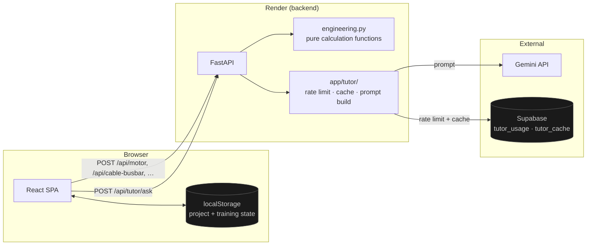
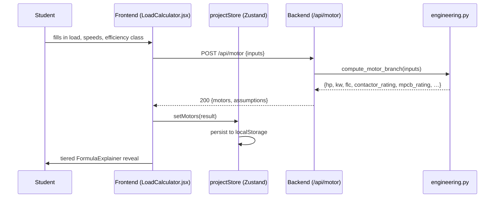
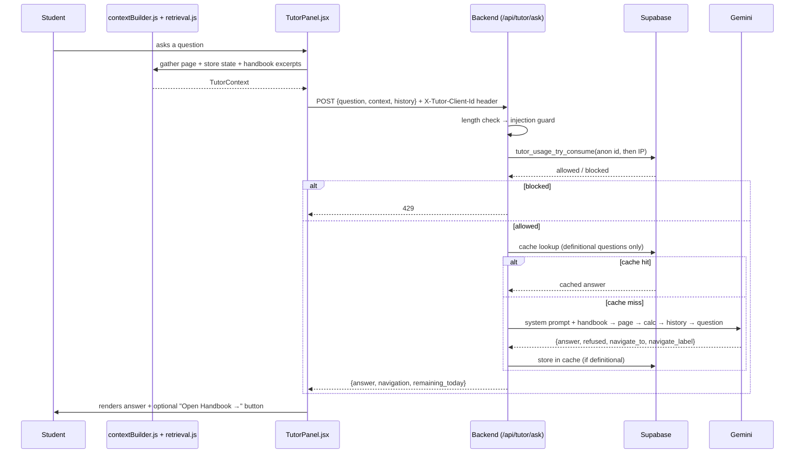

# Architecture Guide

## System overview

Two independently deployed pieces, talking over a small REST API:

- **Frontend** — React 19 + Vite SPA, deployed static (Vercel). Owns almost
  all state: every project field (crane, motors, cable, BOM…) lives in
  Zustand stores persisted to `localStorage`. The backend has no database of
  "your project" — refreshing the page and reopening the app restores state
  entirely from the browser, not a server.
- **Backend** — FastAPI, deployed on Render. Two jobs: (1) pure engineering
  calculations (stateless — same input always produces the same output, no
  persistence needed), and (2) the Engineering Tutor, which *does* need
  persistence (daily limits, answer cache) and uses Supabase for that.

Why split this way: the calculation endpoints are pure functions with no
reason to touch a database — sending the same motor parameters twice should
always return the same answer, so there's nothing to persist. The tutor is
the one part of the app that genuinely needs server-side memory (a daily
question count has to survive across requests), which is why it's the only
thing wired to Supabase.

## Request flow — a calculation

Nothing here is tutor-specific or AI-specific — this is the same
request/response shape for every calculator (nameplate, cable/busbar,
star-delta, BOM), all backed by pure functions in `backend/app/engineering.py`.

## Request flow — the Engineering Tutor

Handbook retrieval happens client-side (`retrieval.js` searches
`handbookContent.js`/`workspaceIndex.js` directly) rather than on the
backend — see `V3_ENGINEERING_TUTOR.md` for why: the handbook content only
has one home, and duplicating it server-side would mean two copies to keep
in sync.

## Tech stack

| Layer | Choice | Why |
|---|---|---|
| Frontend framework | React 19 + Vite | Fast dev server, small production build, no SSR needed (this is a tool, not a content site) |
| Routing | React Router v7 | Standard SPA routing; `React.lazy()` per route for code splitting |
| State | Zustand + `persist` middleware | Far less boilerplate than Redux for what's ultimately a handful of flat stores; `persist` gives localStorage sync for free |
| Styling | Tailwind v4 | Utility classes + CSS custom properties for the design tokens (`--color-ink`, `--color-copper`, etc.) — no separate CSS-in-JS runtime |
| Animation | Framer Motion | Declarative `AnimatePresence` for the tiered disclosure patterns (FormulaExplainer, HandbookEntry, TutorPanel) |
| Charts | Recharts | Only pages that need it (Load Calculator, Cable/Busbar) — isolated into its own lazy-loaded chunk, not in the main bundle |
| Backend framework | FastAPI + Pydantic | Type-validated request/response models for free; async-ready if needed later |
| AI | Gemini (`google-genai` SDK) | Flash-tier model, structured JSON output via `response_schema` |
| Tutor persistence | Supabase (Postgres) | The one place the backend needs real persistence; a hosted Postgres with a generous free tier and a SQL function for atomic rate-limit checks |
| Frontend hosting | Vercel | Static SPA hosting, trivial GitHub-push deploys |
| Backend hosting | Render (free tier) | Free FastAPI hosting — tradeoff: spins down when idle, which is why the tutor's persistence couldn't be in-memory (see `V3_ENGINEERING_TUTOR.md`) |

## Folder structure

See `docs/FOLDER_STRUCTURE.md` for the full annotated tree.

## Design system

Every color, spacing, and radius decision routes through CSS custom
properties defined once in `frontend/src/index.css` (`--color-ink`,
`--color-surface`, `--color-steel`, `--color-copper`, `--color-amber`, status
colors `--color-safe`/`--color-danger`/`--color-caution`/`--color-info`, each
with a `-dim` variant for subtle backgrounds). Every component — from the
original calculator pages to the Engineering Tutor panel built in V3 — pulls
from this same token set rather than hardcoding colors, which is what let the
Tutor panel be added without looking like a bolted-on widget.

Progressive disclosure is the other consistent pattern: `FormulaExplainer`
(four-tier formula breakdowns), `HandbookEntry` (collapsed-by-default
accordions), `RevealCard` (click-to-reveal fault diagnosis), and the newer
generic `CollapsibleSection` (added in this pass) all share the same visual
language (`border-steel` / `bg-inset` / `ChevronDown` rotate) so a page using
several of them doesn't read as several different UI kits stitched together.
